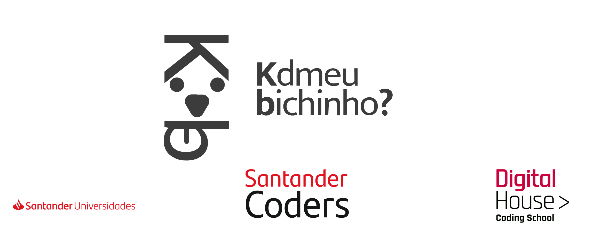
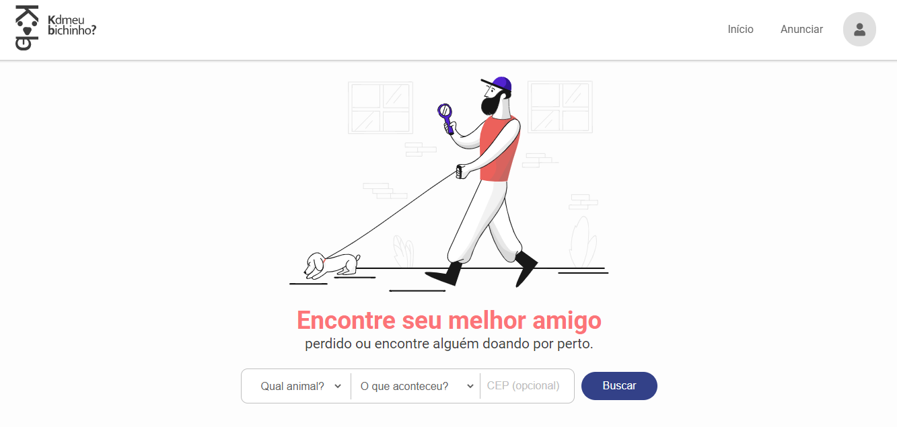
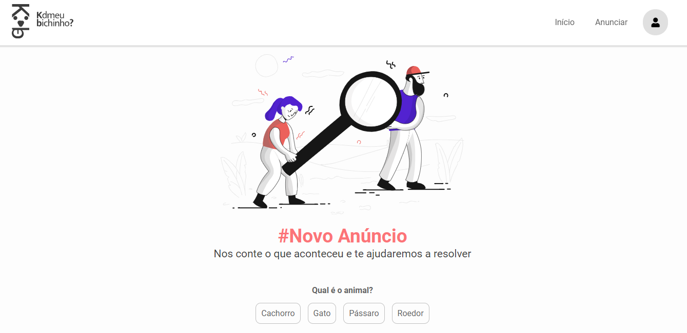
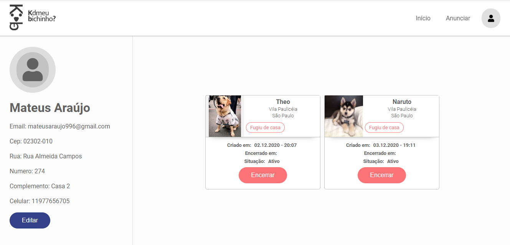
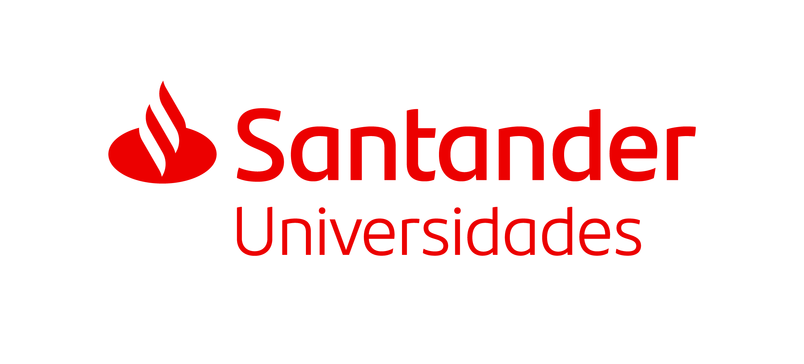

  
 <br>
 <br>


<h4 align="center"> 
	🚧  Kd meu bichinho? 👨‍🏫 em construção ✔️ 🚧
</h4>

## :coffee: Santander Coders

Santander Coders é um programa educacional promovido pelo Banco Santander em parceria com a instituição de ensino Digital House. <br>
Para poder ingressar no programa o aluno, foi submetido a realizar um processo seletivo com o intuito de ser um dos 240 bolsistas, que receberiam bolsas integrais de estudo para o curso de Desenvolvimento Web Full Stack Java.

<br>

## 💻 Sobre o projeto

Projeto integrador desenvolvido durante o curso de Desenvolvimento Web Full Stack Java oferecido pela [digitalhouse](https://www.digitalhouse.com/br/) em parceria com a universidade Santander.
<br>
:shipit: KdMeuBichinho? - O projeto surgiu com a missão de ajudar as pessoas que querem encontrar seu melhor amigo :dog: :cat: :rabbit:  que foi perdido ou encontrar alguém que está doando. 

## :bulb: Ideia do Projeto

```bash
Realizar conexão entre interesses comuns das pessoas e os animais através de suas localizações.

-Pessoas que perderam seus animais e querem encontrá-los.
-Pessoas que encontraram animais perdidos e querem devolvê-los.
-Pessoas que têm animais para doar e adotar.

```

## 🖼 Screenshot das telas da aplicação 

## 🖼 Tela principal da plataforma do KdMeuBichinho? 

  

## 🖼 Tela para a criação do cadastro de um novo animal

<br>
 

<br>

## 🖼 Tela de anúncio dos animais que estão perdidos ou procurando um novo lar

<br>
 
<br>

## 🖼 Tela dos anúncios de um perfil de usuário

<br>
 
<br>

## 🛠 Tecnologias

As seguintes ferramentas foram usadas na construção do projeto:

#### **Front-end** 
<br>
<p align="left">

  <a href="https://developer.mozilla.org/pt-BR/docs/Web/HTML" target="_blank">
    
  </a>

  <a href="https://developer.mozilla.org/pt-BR/docs/Web/CSS" target="_blank">
    
  </a>
  <a
    href="https://developer.mozilla.org/en-US/docs/Web/JavaScript"
    target="_blank"
  >
    
  </a>
  
</p>

<br>

# 👷 Como rodar

```bash
# Clonar o repositório
git clone https://github.com/KdMeuBichinho/kdmeubichinho.github.io

# Entrar numa IDE de sua preferência 

# Executar o servidor ou usar um puglin que criar um servidor

```

Feito isso, abra o seu navegador e acesse `http://localhost:5500/`
ou em uma porta de sua preferência.

## 🤔 Como contribuir ? 🤝  <br/>
```bash
- Faça um fork desse repositório;
- Cria uma branch com a sua feature: `git checkout -b minha-feature`;
- Faça commit das suas alterações: `git commit -m 'feat: Minha nova feature'`; 
- Faça push para a sua branch: `git push origin minha-feature`.

Depois que o merge da sua pull request ser feito, você pode deletar a sua branch. 
```

## **:star2: AGRADECIMENTOS**

<div align=center>

<table style="width:100%">

  <tr align=center>
    <th><strong>Digital House</strong></th>
    <th><strong>Santander Universidades </strong></th>
  </tr>
  
  <tr align=center>
    <td>
      <a href="https://www.digitalhouse.com/br/">
        
      </a>
    </td>
    <td>
      <a href="https://www.santander.com.br/universidades">
        
      </a>
    </td>
  </tr>

</table>

</div>

<br>

## :mortar_board: Autores

<table>
    <tr>
        <td align="center">
            <a href="https://github.com/eRodriguesSantana">
                
                <br />
                <sub><b>Eduardo Rodrigues</b></sub>
            </a>
        </td>
        <td align="center">
            <a href="https://github.com/jackelinenascimento">
                
                <br />
                <sub><b>Jackeline Nascimento</b></sub>
            </a>
        </td>
        <td align="center">
            <a href="https://github.com/Luarlemos">
                
                <br />
                <sub><b>Luciana Lemos</b></sub>
            </a>
        </td>
        <td align="center">
            <a href="https://github.com/teteusAraujo">
                
                <br />
                <sub><b>Mateus Araújo</b></sub>
            </a>
        </td>
        <td align="center">
            <a href="https://github.com/rafaneng">
                
                <br />
                <sub><b>Rafael Santos</b></sub>
            </a>
        </td>
    </tr>
</table>

## 📝 Licença

Este projeto esta sobe a licença MIT.

<h4> :computer: Você consegue acessar a plataforma do KdMeuBichinho :shipit: clicando : <a href="https://kdmeubichinho.github.io/"> AQUI 👋</a></a></h4>
<br>
<h4 align=center>Feito com ❤️ pela <a href="https://kdmeubichinho.github.io/"> Equipe KdMeuBichinho :dog: :cat: :rabbit:👋</a></a></h4>